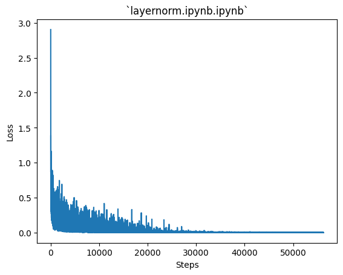

# Contents
* [Neural Networks](https://github.com/VachanVY/NeuroForge?tab=readme-ov-file#neural-networks) => [*nn.ipynb*](https://github.com/VachanVY/NeuroForge/blob/main/nn.ipynb)
  * [Logistic Regression](https://github.com/VachanVY/NeuroForge?tab=readme-ov-file#logistic-regression)
  * [MLP](https://github.com/VachanVY/NeuroForge?tab=readme-ov-file#logistic-regression)
    * [Forward Propagation (Explained on Pen and Paper)](https://github.com/VachanVY/NeuroForge?tab=readme-ov-file#logistic-regression)
    * [Back Propagation (Equations Derived on Pen and Paper)](https://github.com/VachanVY/NeuroForge?tab=readme-ov-file#logistic-regression)
    * [Gradient Descent](https://github.com/VachanVY/NeuroForge?tab=readme-ov-file#logistic-regression)
    * [Train Loop](https://github.com/VachanVY/NeuroForge?tab=readme-ov-file#logistic-regression)
    * [Results](https://github.com/VachanVY/NeuroForge?tab=readme-ov-file#results)
* [Batch-Normalization and Layer-Normalization: **Why When Where & How?**](https://github.com/VachanVY/NeuroForge?tab=readme-ov-file#results) => [*batchnorm.ipynb*]( https://github.com/VachanVY/NeuroForge/blob/main/batchnorm.ipynb), [*layernorm.ipynb*](https://github.com/VachanVY/NeuroForge/blob/main/layernorm.ipynb)
  * [Batch-Normalization](https://github.com/VachanVY/NeuroForge?tab=readme-ov-file#batch-normalization)
  * [Layer-Normalization](https://github.com/VachanVY/NeuroForge?tab=readme-ov-file#layer-normalization)
  * [Comparision](https://github.com/VachanVY/NeuroForge?tab=readme-ov-file#comparision)
* [Dropout: **Why When Where & How?**](https://github.com/VachanVY/NeuroForge?tab=readme-ov-file#dropout-paper-deep-learning-book) => [*dropout.ipynb*](https://github.com/VachanVY/NeuroForge/blob/main/dropout.ipynb), [*dropout_scale.ipynb*](https://github.com/VachanVY/NeuroForge/blob/main/dropout_scale.ipynb)
  * [Comparision before and after scaling the model](https://github.com/VachanVY/NeuroForge?tab=readme-ov-file#comparision-1) => [*dropout_scale.ipynb*](https://github.com/VachanVY/NeuroForge/blob/main/dropout_scale.ipynb), [nn_scale.ipynb](https://github.com/VachanVY/NeuroForge/blob/main/nn_scale.ipynb)
* [Adam and AdamW](https://github.com/VachanVY/NeuroForge?tab=readme-ov-file#adam-and-adamw-adam-with-weight-decay-optimizers)
  * [Adam](https://github.com/VachanVY/NeuroForge?tab=readme-ov-file#adam-and-adamw-adam-with-weight-decay-optimizers)
  * [AdamW](https://github.com/VachanVY/NeuroForge?tab=readme-ov-file#adam-and-adamw-adam-with-weight-decay-optimizers)

# Neural Networks
## Aim of this repo
* This repo aims to make you an MLPWhiz (especially a BackpropWhiz) by creating a Neural Network from scratch **just using `torch.tensor`** (**NO using `torch`'s autograd**) and training them on the `MNIST` dataset (A dataset containing handwritten digits from 0 to 9)

## Roadmap
* The best way to go about this tutorial is to take a pencil and a piece of paper and start deriving particularly the backprop equations once you get the concept
* First we'll start off with logistic regression, which is the simpler form of MLPs just containing 1 layer and can recognize 2 classes, then scale into MLPs by adding many layers and making it recognize as many classes as you want

## Logistic Regression
* Now suppose we want to build a model that classifies a handwritten digit 9 vs any digit that is not 9
* The input to the model are the pixels of the image (which are the features) which are to be linearly transformed so that they can classify the digits, this is done with the help of learnable parameters learned from the data that we will provide
* And here we have to classify 9 vs not 9 so we only need one unit in the last layer (in MLPs we have many classes so we have `n_classes` number of units in the last layer where `n_classes` is the number of classes which will represent the probabilities for the `n_classes` given input)
* Sigmoid function: 

    This function squishes the pre-activations (`Z`) to have a range of (0, 1)
* Then we define a threshold (which is usually 0.5), if the probabilities are above it then the digit is 9 else it's not
* Take a look at the below example\
    
* Forwardprop
    ```python
    X = inputs.reshape((B, H*W*1)) # (B, F=H*W) <= (B, H, W, 1) = (Batch, Height, Width, Num_Channels)
    """
    X = [
         [x00, x01, ..., x0W,
          x10, x11, ..., x1W,
          ...
          xH0, xH1, ..., xHW],
          ... (more batches of examples)
        ]
    """
    W = [[w00], # (F, 1)
         [w10],
         ...
         [wF0]]
    B = [[b0]] # (1, 1) # broadcasted and added to element in Z
    Z = X @ W + B # (B, 1) <= (B, F) @ (F, 1) + (1, 1)
    """
    Z = [[z1 = x00*w00 + x01*w10 + ... + xHW*wF0 + b0],
        ... (more batches of examples)
        ]
    """
    A = sigmoid(Z) # (B, 1)
    ```
* `Z` contains Unnormalized probabilities, the sigmoid function normalizes (range: 0-1) `Z` to get probabilities of whether the digit is 9 (the higher the probability, the more confident the model is that the digit is 9)

* Cost function: We have to penalize the model for predicting wrong values and reward it for predicting the right values

    *We want to minimize the loss to improve our model*
    
    Therefore we use the loss function: 
     which just means that if

    `y_i = 1 (digit is 9)`; Loss is `-log(a_i)` which is negative log-probability of the digit is `9`; So we want to minimize `-log(a_i)` which means we want to maximize `a_i (the probability of digit being 9)` when the digit is actually 9 which is what we want

    `y_i = 0 (digit is not 9)`; Loss is `-log(1 - a_i)` which is negative log-probability of the digit not being `9`; So we want to minimize `-log(1 - a_i)` which means we want to maximize `1 - a_i (the probability of digit not being 9)` when the digit is not 9 which is again what we want 

* Now using the below equations, we'll calculate how we should change the parameters so that they incorporate the learnings from the cost function and make the model better\
    \
    where Y is the true classes (9 or not 9)\
    We'll go through the derivations for the gradients in detail in the MLPs section below
* We'll change the parameters according to the equations below\
    `W = W - lr * dJ_dW`\
    `B = B - lr * dJ_dB`\
    
* The above processes are usually not done taking the whole training set, this results in accurate gradients but this process is very slow as in deep learning, datasets are very large\
 Instead we take `batch_size` number of train examples from the dataset and do the above process, this results in the gradients being less accurate but this is much faster and has proved to be very much effective in practice
* We repeat the above processes for a number of `epochs`, till the model converges, see the training loop sub-section in the MLPs section for more details

---
## MLPs
### Forward Propagation
* We stack many layers with a relu activation in-between layers and at the end add a softmax layer which calculates the probabilities given unnormalized activations
* Here unlike the sigmoid function we have `n_classes` number of units in the last layer where `n_classes` is the number of classes where each unit will represent the probabilities for each class given input
* 
* Cross Entropy Loss calculation:

We want to increase the probabilities of the true classes, therefore we minimize negative log-probs which does the same

### Back-propagation
* 
* 
* 
* 
* 
* 

### Gradient Descent
* The negative gradient tells us the direction that corresponds to the steepest descent within an infinitesimally small region surrounding the current parameters
* So it's important to scale them down so that the training is stable, we do this with the help of the learning rate (lr), always keeping it less than 1 (  for very deep models we keep the lr of the order `1e-3` to `1e-5` so that the training is stable)
* We want to minimize the Loss (with the weights and biases as the parameters), we want to go down to the lowest point, the negative gradients give us the direction to the lowest point, and subtracting the parameters from their scaled-down gradients takes us downhill the Loss landscape\

* 
    ```python
    params = [w1, b1, w2, b2, w3, b3]
    grads = [dL_dw1, dL_db1, dL_dw2, dL_db2, dL_dw3, dL_db3]

    for i in range(len(params)):
        params[i] = params[i] - lr*grads[i]
    ```
* Additional Note: Neural Network optimization is a non-convex optimization problem\
  

---
### Training Loop
* 
    ```python
    for epoch in range(epochs):
        for step in range(steps):
            X_batch, y_batch = get_batch(X, y)
            # forward prop
            # backward prop
            # gradient descent
            ...
    ```
    In one step the model is trained on `batch_size` number of train examples\
    In one `epoch` which contains `steps` number of steps, the model is trained on all the train examples\
    This done for `epochs` number of epochs, till the model converges

---
## Results
```
Train Accuracy:      0.9969 | Train Loss: 0.0187 |
Validation Accuracy: 0.9794 | Validation Loss: 0.0665 |
```
* See the notebook to see predictions

# Batch-Normalization and Layer-Normalization
## Batch-Normalization
* 
* Training Deep Neural Networks is complicated by the fact that the distribution of each layer's inputs changes during training, as the parameters of the previous layers change. 
* This slows down the training by requiring lower learning rates and careful parameter initialization, and makes it notoriously hard to train models with saturating nonlinearities. 
* We refer to this phenomenon as internal covariate shift, and address the problem by normalizing layer inputs
* Our methoddraws its strength from making normalization a part of the modelarchitecture and performingthe normalization for each training mini-batch
* Batch Normalization allows us to use much higher learningrates and be less careful about initialization
* Batch Normalization achieves the same accuracy with 14 times fewer training steps, and beats the original model by a significant margin
* **The change in the distributions of layers' inputs presents a problem because the layers need to continuously adapt to the new distribution. When the input distribution to a learning system changes, it is said to experience covariate shift**
* 
* 

## Layer-Normalization
* It is common among the NLP tasks to have different sentence lengths for different training cases. This is easy to deal with in an RNN because the same weights are used at every time-step. But when we apply batch normalization to an RNN in the obvious way, we need to to compute and store separate statistics for each time step in a sequence. This is problematic if a test sequence is longer than any of the training sequences. Layer normalization does not have such problem because its normalization terms depend only on the summed inputs to a layer at the current time-step. It also has only one set of gain and bias parameters shared over all time-steps.
* Here we just take mean-variance stats along the feature dimention, now no need for storing running mean and variance for inference!
* 

### Comparision
* As you can see with normalization, the model learns/overfits faster than the model without it
* 

  No Normalization:    `Epoch: 30/30 | Loss: 0.0205 | Avg time per step: 0.44 ms | Validation Loss: 0.0649 |`\
  Batch-Normalization: `Epoch: 9/30  | Loss: 0.0167 | Avg time per step: 0.79 ms | Validation Loss: 0.0899 |`\
  Layer-Normalization: `Epoch: 14/30 | Loss: 0.0050 | Avg time per step: 0.73 ms | Validation Loss: 0.0772 |`

* For some reason Validation Loss for model with normalization is not better than the model without any normalization, maybe it'll be better when the model gets deeper (i.e when number of layers increases) (**correct???**)
* <!-- Batch-Normalization is worst among others, maybe it's because of the variance in the running mean-variance and the actual mean-variance stats... not sure (**correct???**) -->

# Dropout [[Paper]](https://www.cs.toronto.edu/~rsalakhu/papers/srivastava14a.pdf) [[Deep-Learning Book]](https://www.deeplearningbook.org/contents/regularization.html#pf20:~:text=7.12-,Dropout,-Dropout)
* 
* To a first approximation, dropout can be thought of as a method of making bagging practical for ensembles of very many large neural networks

* Dropout training is not quite the same as bagging training. In the case ofbagging, the models are all independent. In the case of dropout, the modelsshare parameters, with each model inheriting a different subset of parametersfrom the parent neural network
* 
  If a unit is retained with probability p during training, the outgoing weights of that unit are multiplied by p at test time as shown in Figure 2. This ensures that for any hidden unit the expected output (under the distribution used to drop units at training time) is the same as the actual output at test time
* In the case of bagging, each model i produces a probability distribution


Because this sum includes an exponential number of terms, it is intractable to evaluate.
Even 10–20 masks are often sufficient to obtaingood performance.
* An even better approach, however, allows us to obtain a good approximation tothe predictions of the entire ensemble, at the cost of only one forward propagation. To do so, we change to using the geometric mean rather than the arithmetic mean ofthe ensemble members’ predicted distributions

* 

* For many classes of models that do not have nonlinear hidden units, the weight scaling inference rule is exact


* 
Using Properties of exponents ($e^a*e^b = e^{a+b}$ and $\sqrt{e}=e^{1/2}$) we get 

Now the term in the exp (don't take the bias) is the expectation of 

  which is  because expectation of $d$ is just the **probablity of inclusion**

  
* Another method is where we would leave the inputs unchanged at inference time, but at training time we scale the retained inputs by $1/p$ where $p$ is the probabilty of inclusion. This is the method which is used in the implementation
* Dropping out 20% of the input units and 50% of the hidden units was often found to be optimal
(In the simplest case, each unit is retained with a fixed probability p independent of other units, where p can be chosen using a validation set or can simply be set at 0.5, which seems to be close to optimal for a wide range of networks and tasks. For the input units, however, the optimal probability of retention is usually closer to 1 than to 0.5.)
* Bernoulli Distribution is used to mask the input values


### Comparision
* Without Scaling Model\
   
* After Scaling Model\
   
  * In `nn_scale.ipynb` validation loss starts increasing...
    Now see `dropput_scale.ipynb`, the gap between training and validation metrics is lesser than in `nn_scale.ipynb`
  * Validation metrics has improved but at the cost of training metrics
* See the notebooks for the train logs

# Adam and AdamW (Adam with weight decay) Optimizers
## Adam
* 

## AdamW
* What's weight decay?\
  
* Paper Implementaion
 
* L2 regularization and weight decay regularization are equivalent for standard stochastic gradient descent (when rescaled by the learning rate), but as we demonstrate this is not the case for adaptive gradient algorithms, such as Adam
* Common implementations of these algorithms employ L2 regularization (often calling it “weight decay” in what may be misleading due to the inequivalence we expose). For example see the pytorch implementation of Adam (which is wrong) below
  
* $L = CE + \left(\frac{\lambda}{2}\theta^2\right)$\
  $\nabla L = \nabla CE + \nabla \left(\frac{\lambda}{2}\theta^2\right) = \nabla CE +  \lambda\theta$\
  This is the same expression in above images/image for weight decay but it's actually for `L2 Loss` as shown in the equations here
  The corrected version is given below
  


---
# Contribution guidelines
* This repository aims to demystify neural networks, and any efforts aimed at simplification and enhancing accessibility will be incorporated
* Contributions towards changing the handwritten equations into LaTeX format are welcomed and encouraged.

---
# References
* [**Blog**: Sigmoid, Softmax and their derivatives](https://themaverickmeerkat.com/2019-10-23-Softmax/)
* [**Video**: Becoming a Backprop Ninja](https://www.youtube.com/watch?v=q8SA3rM6ckI)
* Batch-Norm, Layer-Norm, Dropout, Adam and AdamW Papers

# For Further Studies
* [**Video**: Neural Networks: Zero to Hero](https://www.youtube.com/playlist?list=PLAqhIrjkxbuWI23v9cThsA9GvCAUhRvKZ)
* [**Book**: Deep Learning by Ian Goodfellow](https://www.deeplearningbook.org/)
